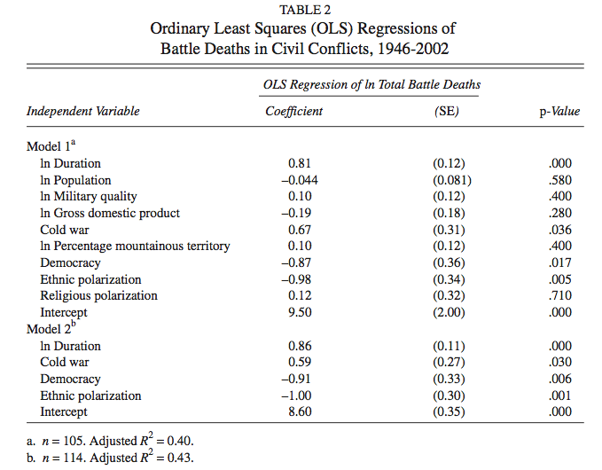

```{r, include=FALSE}
knitr::opts_knit$set(root.dir = "../")
library(ggplot2)
```

# Zur Erinnerung: Zweck der Regression

- Formulierung eines plausiblen Modells für die Wirkung von Einflussgrößen (unabhängigen Variablen) auf die abhängige Größe (abhängige Variable),
- Quantifizierung der Wirkung von Einflussgrößen,
- Bestimmung der statistischen Signifikanz von Effekten,
- Vorhersage der abhängigen Größe bei neuen Beobachtungen.

# Lineare Einfachregression
```{r, echo=FALSE}
lacina <- read.csv("./data/lacina/lacina.csv", stringsAsFactors = FALSE)
ggplot(lacina, aes(lnduration, lnbdb)) +
  geom_point() +
  geom_smooth(method="lm", se=FALSE)
```

# Lineare Einfachregression in R
```{r, eval=FALSE}
lacina_one <- lm(lnbdb ~ lnduration, data = lacina)
summary(lacina_one)
```
\tiny
```{r, echo=FALSE}
lacina_one <- lm(lnbdb ~ lnduration, data = lacina)
summary(lacina_one)
```

# Modellqualität
```{r, eval=FALSE}
par(mfrow=c(2,2))
plot(lacina_one)
```

```{r, echo=FALSE}
par(mfrow=c(2,2))
plot(lacina_one)
```


# $R^2$
```{r, echo=FALSE}
lacina <- read.csv("./data/lacina/lacina.csv", stringsAsFactors = FALSE)
ggplot(lacina, aes(lnduration, lnbdb)) +
  geom_point() +
  geom_line(aes(lnduration, mean(lnbdb)), colour = "red") +
  geom_smooth(method="lm", se=FALSE)
```

# $R^2$ -- Intuition

- Wieviel Varianz der abhängigen Variable wird durch das Modell erklärt?
$$ R^2 = \frac{\sum (\hat{y_i} - \bar{y})^2}{\sum (y_i - \bar{y})^2} = \frac{\text{Variation der Regresswerte}}{\text{Variation von Y}}$$

- Manuelle Berechnung:
```{r}
sum((fitted(lacina_one) - mean(lacina$lnbdb))^2) / 
  sum((lacina$lnbdb - mean(lacina$lnbdb))^2)
```

- Oder einfach:
```{r}
summary(lacina_one)$r.squared
```

# Vorsicht!
Nicht einfach nur $R^2$ maximieren! Annahmen beachten!

# Multiple Regression

- Bisher: $$ y_i = \beta_0 + \beta_1 x_i + \epsilon_i $$

- Jetzt: $$ y_i = \beta_0 + \beta_1 x_{1i} + \beta_2 x_{2i} + \cdots + \beta_m x_{mi} + \epsilon_i $$

# Lacina-Modell


# Replikation des Lacina-Modells
\small
```{r}
model1 <- lm(lnbdb ~ lnduration + lnpop + lnmilqual + 
               lngdp + cw + lnmountain + 
               democ + ethnicpolar + relpolar,
             data = lacina)
summary(model1)
```

