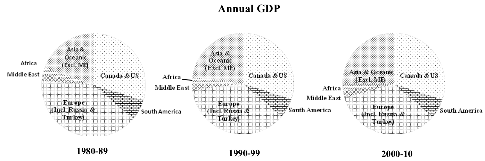

```{r, include=FALSE}
knitr::opts_knit$set(root.dir = "../")
#knitr::opts_chunk$set(out.width='200px', dpi=200)

library(ggplot2)
library(plyr)
library(dplyr)
library(tidyr)
library(maps)
library(countrycode)
library(ggthemes)
library(stargazer)
library(dotwhisker)
```

# Kursinhalte bisher

- reine Datenverarbeitung in R
- Berechnung statistischer Modelle
    + stetige abhängige Variable: OLS-Modell
    + binäre abhängige Variable: Logit-Modell
- Interpretation von Modellergebnissen


# Was fehlt?

- Aufbereitung und Präsentation von
    + Daten
    + Zusammenhängen
    + Ergebnissen
    
$\rightarrow$ **verständliche** Abbildungen und Tabellen
    
# Nicht so! Warum?



# Nicht so! Warum?


# Nicht so! Warum?


# Nicht so! Warum?


# Lacina: Tote pro 1000 Einwohner

<!---
```{r lacina_map_data, include=FALSE, cache=TRUE}


lacina <- read.csv("./data/lacina/lacina.csv")
lacina$cname <- sub("RUM", "ROM", lacina$cname)
lacina$cname <- sub("PAk", "PAK", lacina$cname)

world <- map_data("world")

ids <- select(world, region, group) %>%
  distinct(region)

deaths <- lacina %>%
  group_by(cname) %>%
  summarise(deaths = sum(battledeadbest, na.rm = TRUE),
            population = mean(pop)) %>%
  mutate(deaths_per_1000 = deaths/population * 1000,
         country = countrycode(cname, "cowc", "country.name")) %>%
  right_join(world, c("country" = "region"))
```

```{r lacina_map, echo=FALSE, cache=TRUE}
lacina_map <- ggplot(deaths, aes(long, lat, group = group, fill = deaths_per_1000)) +
  geom_polygon(colour = "black") +
  scale_fill_gradientn(colours=c("white", "red")) +
  theme_bw()

plot(lacina_map)
```
--->

# Rechte Gewalt in Deutschland (2014--2015)


# Buhaug/Gates: Regressionsergebnisse -- Tabelle
```{r regression_table_data, echo=FALSE, cache=TRUE}
buhaug <- read.csv("./data/aufgabenblatt/buhaug_gates.csv", stringsAsFactors = FALSE)

model_1 <- lm(location ~ ln_abs_scope + ln_land_area + identity + incompatibility,
              data = buhaug)
model_2 <- lm(location ~ rel_scope + ln_land_area + identity + incompatibility,
              data = buhaug)
model_3 <- lm(ln_abs_scope ~ location + ln_land_area + duration + border + resource,
              data = buhaug)
model_4 <- lm(ln_abs_scope ~ location + ln_land_area + duration + border + resource +
                mountain + forest,
              data = buhaug)
model_5 <- lm(rel_scope ~ location + ln_land_area + duration + border + resource,
              data = buhaug)
model_6 <- lm(rel_scope ~ location + ln_land_area + duration + border + resource +
                mountain + forest,
              data = buhaug)
```

\begin{table}
\resizebox{0.6\columnwidth}{!}{
```{r regression_table, echo=FALSE, results="asis"}
stargazer(list(model_1, model_2), header = FALSE, style="apsr", float = FALSE)
```
}
\end{table}


# Buhaug/Gates: Regressionsergebnisse -- Grafik
```{r regression_plot, echo=FALSE}
dwplot(list(model_1, model_2),  alpha=0.05) +
  geom_vline(xintercept = 0) +
  scale_color_discrete(name="") +
  theme_bw()
```


# Hinweise für gute Grafiken

- Rob Hyndman: "Twenty rules for good graphics" (http://robjhyndman.com/hyndsight/graphics/)

- Edward Tufte: "The Visual Display of Quantitative Information" (http://www.amazon.com/dp/0961392142/)

- William Cleveland: "The Elements of Graphing Data" (http://www.amazon.com/dp/0963488414/)

<!---
# R Markdown: Replizierbare Dokumente und Präsentationen

Primäres Nachschlagewerk: http://rmarkdown.rstudio.com

- Einfaches Erstellen von Dokumenten und Präsentationen
- Replizierbare Dokumente:
    + nachvollziehbar
    + flexibel bei Änderung/Aktualisierung von Analysedaten
- verschiedene Output-Formate: 
    + MS Word
    + HTML
    + PDF (via \LaTeX)
--->
