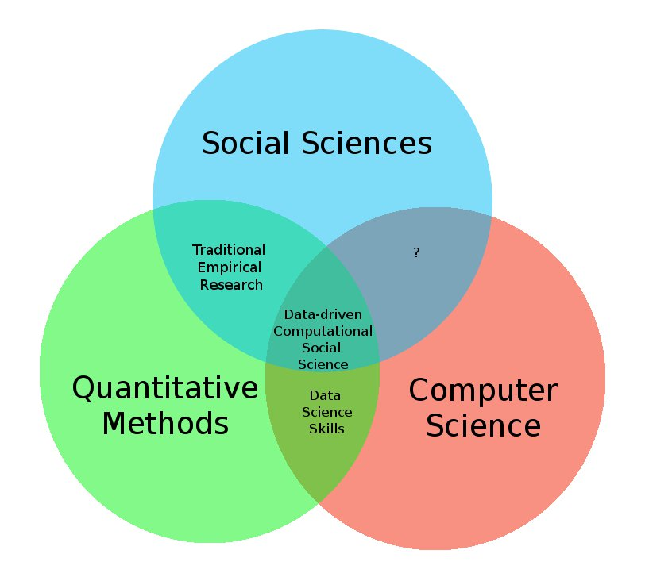
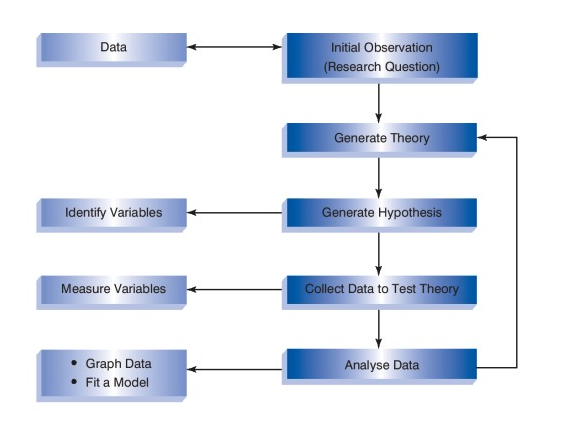
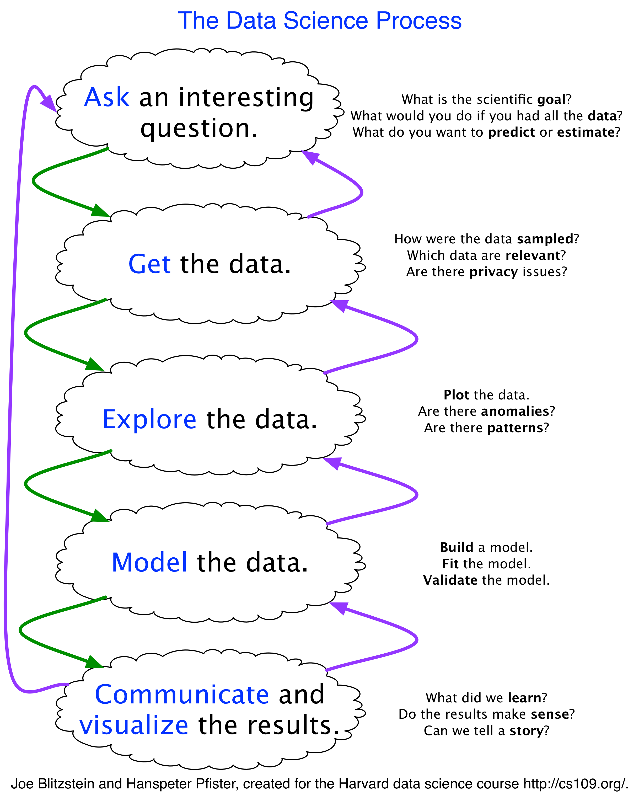
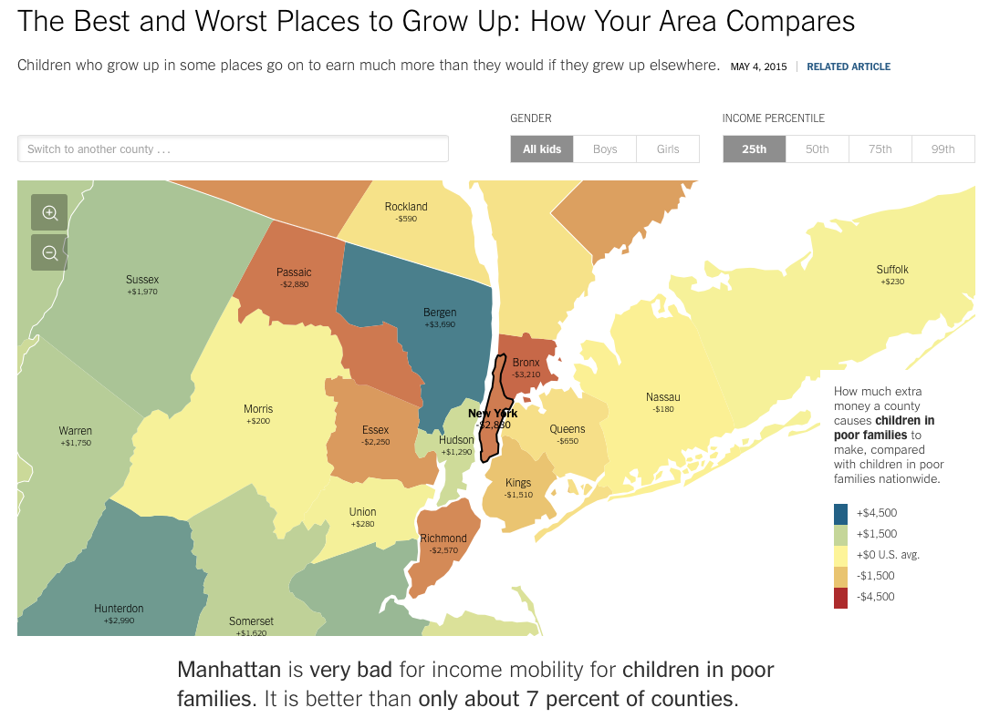
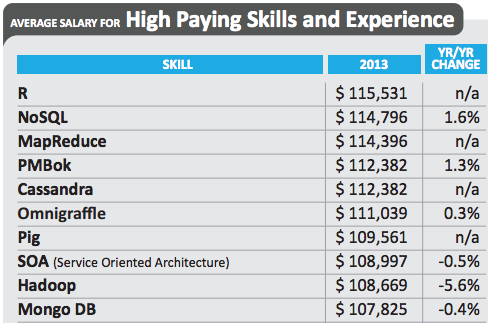
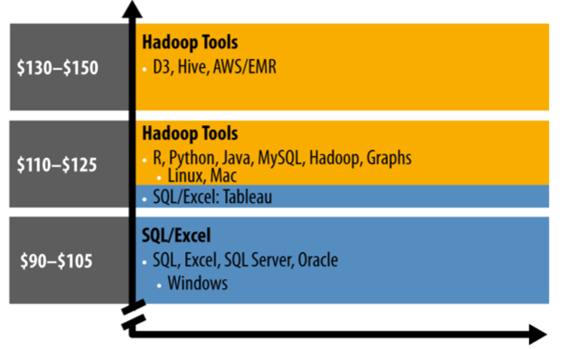

# Warum sind wir hier?

- Politikwissenschaftler und Datenanalyse?
- Wissenschaft als Beantwortung offener Fragen.
- Antworten erfordern Daten.

# Gesamtbild

# Beispiele

- Demokratien führen keine Kriege gegeneinander.
- Bürgerkriege finden eher in armen Ländern statt.
- Negative Einstellungen gegenüber Flüchtlingen sind höher in Regionen mit hoher Arbeitslosigkeit.

# Beispiele - Daten
1. Demokratien führen keine Kriege gegeneinander.
  - Zwischenstaatliche Kriege in einem bestimmten Zeitraum, Dyaden der Kriegsparteien.
  - Politisches System der jeweiligen Staaten zu Kriegsbeginn (Kategorien: D/ND? Kontinuum?)
  - Möglicherweise noch Ursache/Anlass des Konflikts (eingeteilt in Kategorien?)
  
# Beispiele - Daten
2. Bürgerkriege finden eher in armen Ländern statt.
  - Alle Bürgerkriege als Universum der relevanten Fälle.
  - Armutsmaß je Land: z.B. BIP pro Kopf; Jahresdaten, Veränderungsraten...

# Beispiele - Daten
3. Negative Einstellungen gegenüber Flüchtlingen sind höher in Regionen mit hoher Arbeitslosigkeit.
  - Repräsentative Meinungsdaten;
  - Arbeitslosenquoten;
  - möglichst disaggregiert auf Länder-/Kreis-/Gemeindeebene;
  - andere Einflüsse relevant? -> Kontrollvariablen

# Forschungsprozess

\tiny Quelle: Field, Miles, Field (2012): Discovering Statistics Using R.

# Arbeitsprozess

# Data Science

# Weshalb benutzen wir spezielle Software?

- Excel reicht doch aus, um Daten zu verarbeiten, oder?
- Nicht im wissenschaftlichen Sinne!
  - keine **Replizierbarkeit**
  - Umständliche Veränderungen vorheriger Schritte im Datenverarbeitungsprozess
  - komplexere Modelle, die über deskriptive Statistiken hinausgehen sind kaum möglich.
Deshalb:
- wissenschaftliche Statistiksoftware (z.B. Stata, Matlab, SPSS, EViews...)
- wir nutzen in diesem Kurs R.

# Warum R?
- Freie Software.
- Gewaltiger Funktionsumfang, der stetig erweitert und verbessert wird.
- Zusätzliche Funktionen werden mithilfe von Paketen geladen. Diese sind über CRAN (Comprehensive R Archive Network) herunterzuladen.
- Sehr aktive Community.
- Hoher Verbreitungsgrad in Wissenschaft und wachsend in der Wirtschaft.

# R bei der NY-Times

# Persönlicher Nutzen
- R als universelles Werkzeug der Datenanalyse
- Sie lernen durch die Programmiersprache strukturiert und analytisch zu denken.
- R-Anwender sind gesucht!

# R auf dem Arbeitsmarkt

# R auf dem Arbeitsmarkt

# Hinweise für eine erfolgreiche Teilnahme

- Keine Pogrammierkenntnisse erforderlich (aber hilfreich).
- Nachvollziehen und aktive Nutzung der Beispiele hilft Ihrem Lernprozess.
- R ist eine Sprache:
  - Vokabeln
  - Grammatik
- Fehler helfen beim Lernen!

# Organisatorisches

Termine:

------------------------------------------------------------------------------
  Sitzung     Datum         Thema
---------     --------      ------------------------------------
        1     19.10.15      Ziele quantitativer Forschung, Grundbegriffe der Datenanalyse
            
        2     26.10.15      Einführung in R & RStudio, grundlegende Funktionen
          
        3     02.11.15      Statistische Grundlagen, Berechnung in R
            
        4     09.11.15      Statistische Grundlagen, Berechnung in R
            
        5     16.11.15      Deskriptive Statistiken und Datenvisualisierung
            
        6     23.11.15      Plots und Datenverarbeitung
            
        7     30.11.15      Datenverarbeitung
-------------------------------------------------------------------------------

# Organisatorisches II

Termine:

------------------------------------------------------------------------------
  Sitzung     Datum         Thema
---------     --------      ------------------------------------            
        8     07.12.15      Lineare Regression
            
        9     11.01.16      Logit-Modell
            
       10     18.01.16      Zähl-Modell
           
       11     25.01.16      Anwendungsbeispiele
           
       12     01.02.16      Wiederholung/Fragestunde
           
       13     08.02.16      Klausur: Replikation einer Studie
-------------------------------------------------------------------------------

# Organisatorisches III
## Leistungsnachweis:
  - Aufgabenblatt in der Weihnachtspause (25%)
  - Klausur (auch eine Art Aufgabenblatt) (75%)

# Organisatorisches IV
- Folien über OLAT

- Folien, Datensätze und Code auf Github: [http://www.github.com/davben/stats-with-r](http://www.github.com/davben/stats-with-r)

- Sprechstunde nach Vereinbarung: david.bencek@ifw-kiel.de

# Einstieg in R und RStudio

    

